# UpgradeCart

## Overview

UpgradeCart is a dynamic e-commerce web application engineered to elevate the online shopping journey for users. The platform stands out with its adoption of Redux, a powerful state management tool, to arrange seamless and responsive global state changes. UpgradeCart offers an array of features, including intuitive product browsing, detailed product views, user authentication, and a robust shopping cart system.

### Key Features

- **Efficient State Management:** UpgradeCart uses the power of Redux for efficient global state management, ensuring a smooth and responsive user interface.

- **Product Exploration:** Users can effortlessly explore a diverse range of products, complete with detailed information and captivating visuals to aid their decision-making process.

- **User Authentication:** Secure registration and login functionality encourages users to personalize their shopping experience, including managing their shopping cart and reviewing their order history.

- **Shopping Cart Mastery:** The application boasts an intuitive shopping cart system, allowing users to seamlessly add, remove, and adjust quantities of products as they shop.

- **Streamlined Order Processing:** UpgradeCart prioritizes a streamlined order processing system, promising a hassle-free checkout experience with secure transaction handling and instant order confirmation.

### Purpose

UpgradeCart is crafted with the purpose of offering an enhanced and user-friendly e-commerce solution. By adopting Redux for state management, the platform ensures a responsive and dynamic shopping experience. The objective is to simplify the intricacies of online shopping, providing users with a seamless interface to browse, select, and purchase products confidently. Elevate your online shopping experience with UpgradeCart.

## Table of Contents

- [Description](#description)
- [Tools](#tools)
- [Technology Stack](#technology-stack)
- [Installation](#installation)
- [Usage](#usage)
- [Testing](#testing)
- [Links](#links)
- [Credits](#credits)
- [Contributing](#contributing)
- [Report Issue](#report-issue)
- [License](#license)

## Description

UpgradeCart is a modern online shopping platform that utilizes advanced state management techniques to provide a seamless and dynamic user experience. With a focus on enhancing the online shopping journey, UpgradeCart incorporates features such as intuitive product exploration, secure user authentication, and a streamlined shopping cart system. The platform aims to simplify the complexities of online shopping, offering users a responsive and engaging interface for a hassle-free shopping experience.

### What is it about?

At its core, UpgradeCart is about redefining the online shopping experience. The platform facilitates intuitive product browsing, detailed product views, user authentication for a secure environment, and a reliable shopping cart system. It brings together the essential elements needed for a smooth and enjoyable online shopping journey.

### What problem does it solve?

Online shopping can often be overwhelming, with users facing issues related to state management, responsive interfaces, and secure authentication. UpgradeCart solves these problems by efficiently managing global states with Redux, ensuring a responsive and user-friendly interface. The platform aims to simplify online shopping, making it a hassle-free and enjoyable experience for users.

In summary, UpgradeCart is designed to revolutionize online shopping by addressing common pain points, providing a solution that is dynamic, responsive, and user-centric.

[Top](#upgradecart) | [Table of Contents](#table-of-contents)

## Tools

To interact effectively with UpgradeCart, users will need the following tools:

1. **Web Browser:** UpgradeCart is a web-based application, and a modern web browser such as Google Chrome, Mozilla Firefox, Safari, or Microsoft Edge is recommended for optimal performance.

2. **Internet Connection:** A stable and reliable internet connection is essential to access and use UpgradeCart seamlessly.

3. **Device:** UpgradeCart is designed to be responsive and accessible across various devices, including desktops, laptops, tablets, and smartphones. Users can choose the device that suits their preferences.

4. **Redux DevTools Extension (Optional):** For users who want to explore and debug the global state management implemented with Redux, installing the Redux DevTools extension for their web browser can be beneficial.

These tools are the key components required to interact with UpgradeCart effectively and make the most out of its features.

[Top](#upgradecart) | [Table of Contents](#table-of-contents)

## Technology Stack

UpgradeCart relies on a comprehensive set of tools to ensure efficient development and seamless functionality across both its server and client components.

### Root Package.json

#### Project Commands/Scripts

- **start:** Initiates the server using `node server/server.js`, excluding the client.
- **develop:** Concurrently runs server and client development environments for a streamlined development experience.
- **install:** Installs server and client dependencies to ensure a smooth integration of required packages.
- **seed:** Seeds data into the server, populating the database with initial information.
- **build:** Compiles the client using cd client && npm run build, preparing the application for deployment.

#### Dev Dependencies

- **concurrently:** ^8.2.0
  - Facilitates the concurrent execution of multiple commands during development, enhancing the development workflow.

### Server Package.json

#### Project Commands/Scripts

- **start** Initiates the server using `node server.js`, launching the application.
- **watch:** Operates the server using `nodemon` for automatic restarts during development.
- **seed:** Seeds data into the server using `node config/seeds.js`, populating the database with initial information.

#### Dependencies

- **@apollo/server:** ^4.9.5

  - Implements a GraphQL server for defining schemas and resolving queries. Used for server-side testing.

- **bcrypt:** ^5.0.0

  - Library for hashing passwords, commonly used for secure password storage.

- **dotenv:** ^16.3.1

  - Loads environment variables from a .env file into process.env, aiding in configuration management during development.

- **express:** ^4.17.2

  - Fast and minimalist web framework for Node.js, simplifying building robust web applications.

- **graphql:** ^16.6.0
  -Query language and runtime for APIs, often used with Apollo Server for GraphQL.

- **jsonwebtoken:** ^9.0.2

  - Generates and verifies JSON Web Tokens (JWT) for user authentication and authorization.

- **mongoose:** ^7.0.2

  - Object Data Modeling (ODM) library for MongoDB and Node.js, providing schema-based data modeling.

- **stripe:** ^8.67.0
  - Library for interacting with the Stripe API, enabling secure payment processing.

#### Dev Dependencies

- **nodemon:** ^2.0.3
  - Utility that monitors changes in Node.js applications and automatically restarts the server during development.

### Client Package.json

#### Project Commands/Scripts

- **dev:** Run Vite for development, initiating the development server for a smooth and fast-paced development experience.
- **build:** Build the client using Vite, generating a production-ready bundle for deployment.
- **lint:** Run ESLint for linting, ensuring code quality and adherence to coding standards in the source code.
- **prebuild:** Install Redux and React-Redux before the build process to ensure necessary dependencies are present.
- **preview:** Preview the client using Vite, providing a local environment to review the application before deployment.
- **test:** Run Vitest for testing, executing the test suite to ensure the reliability of the client-side code.

#### Dependencies

- **@apollo/client:** ^3.7.15

  - Client library for interacting with a GraphQL server, facilitating queries and mutations.

- **@stripe/stripe-js:** ^1.54.0

  - JavaScript library for interacting with the Stripe API, enabling secure payment processing.

- **@testing-library/react:** ^14.0.0

  - Testing utilities for React applications, aiding in the creation of robust and reliable tests.

- **graphql:** ^16.6.0

  - Query language and runtime for APIs, commonly used with Apollo Client for GraphQL.

- **happy-dom:** ^9.20.3

  - Library for creating a simulated DOM environment, useful for testing purposes.

- **jwt-decode:** ^3.1.2

  - Library for decoding JSON Web Tokens (JWT) on the client side, useful for authentication.

- **react:** ^18.2.0

  - JavaScript library for building user interfaces and managing application state.

- **react-dom:** ^18.2.0

  - Entry point for the React DOM library, enabling rendering React components in the browser.

- **react-router-dom:** ^6.11.2

  - Library for adding routing functionality to React applications.

- **vitest:** ^0.32.0

  - Testing framework for Vite, offering features for efficient client-side testing.

- **redux:** ^4.1.2

  - Predictable state container for JavaScript applications, used for efficient state management.

- **react-redux:** ^7.2.5
  - Official React bindings for Redux, facilitating the integration of Redux with React components.

#### Dev Dependencies

- **@types/react:** ^18.0.37

  - Type definitions for React, enhancing development with type information and autocompletion.

- **@types/react-dom:** ^18.0.11

  - Type definitions for React DOM, providing type information for React DOM-specific features.

- **@vitejs/plugin-react:** ^4.0.0

  - Vite plugin enabling React support, particularly useful for fast development with features like hot module replacement.

- **eslint:** ^8.38.0

  - Tool for identifying and fixing problems in JavaScript code, ensuring code quality and consistency.

- **eslint-plugin-react:** ^7.32.2

  - ESLint plugin for React, providing rules and configurations for best practices.

- **eslint-plugin-react-hooks:** ^4.6.0

  - ESLint plugin enforcing rules related to React Hooks usage.

- **eslint-plugin-react-refresh:** ^0.3.4

  - ESLint plugin related to React Refresh, providing rules for faster development.

- **vite:** ^4.3.9
  - Fast build tool for modern web development, particularly effective for React projects with features like lightning-fast hot module replacement.

The carefully chosen packages and dependencies in each section contribute to creating a robust, responsive, and feature-rich UpgradeCart application, ensuring a smooth experience for both developers and end-users alike.

[Top](#upgradecart) | [Table of Contents](#table-of-contents)

## Installation

### Prerequisites:

Before starting, make sure to have the following installed on the local system:

- **Node.js:** UpgradeCart relies on `Node.js` for its server and client-side development. You can download [here](https://nodejs.org/en).

- **npm:** This is the package manager for Node.js. It comes bundled with Node.js, so no need to install it separately.

### Step-by-Step Instructions:

Follow these step-by-step instructions to set up UpgradeCart on your local machine:

1. **Clone the Repository:**

   Open your terminal and run the following command to clone the UpgradeCart repository:

   ```
   git clone git@github.com:Clkwong3/UpgradeCart.git
   ```

2. **Navigate to the Root Directory:**

   ```
   cd Upgradecart
   ```

3. **Install Dependencies:**

- In the root directory, install the all the dependencies including the server and client by using the terminal:

  ```
  npm install
  ```

4. **Seed Data (Optional):**

- To include the seed data from the server, run the following command:

  ```
  npm run seed
  ```

  This command populates the server's database with initial information.

5. **Build the Client:**

   ```
   npm run build
   ```

   This command compiles the client-side code and prepares it for deployment.

6. **Configuration and Environment Variables:**

   1. **Server Configuration:**

   - Navigate to the server directory:
     ```
     cd server
     ```
   - **Environment Variables:** Create a `.env` file in the `server` directory and add necessary environment variables. These variables may include database connection details, API keys, or any other sensitive information.

   - **Additional Configurations:** Check for any other configuration files specific to the server setup. These might include database connection files, GraphQL schema definitions, or any custom configurations.

   2. **Client Configuration:**

   - Navigate to the client directory:
     ```
     cd client
     ```
   - **Environment Variables:** Some client-side configurations may require environment variables. If so, create a `.env` file in the `client` directory and add the necessary variables.

   - **Additional Configurations:** Check for any specific configurations in the client-side code, such as API endpoints or authentication configurations.

   Remember to update the .env files with appropriate values for your specific setup.

7. **Running the Application:**

- After setting up configurations:

  ```
  npm run develop
  ```

  This will start both the server and the client, making UpgradeCart accessible.

  Visit `http://localhost:your-port-number` in the web browser, replacing your-port-number with the specified port number from the server configuration.

That's it! You've successfully installed and set up UpgradeCart on your system.

[Top](#upgradecart) | [Table of Contents](#table-of-contents)

## Usage

UpgradeCart provides a user-friendly interface for seamless shopping. Visit the application in your web browser (usually http://localhost:3000) to explore and interact with the following features:

- Browse categories and products.

  **Home Page:**

  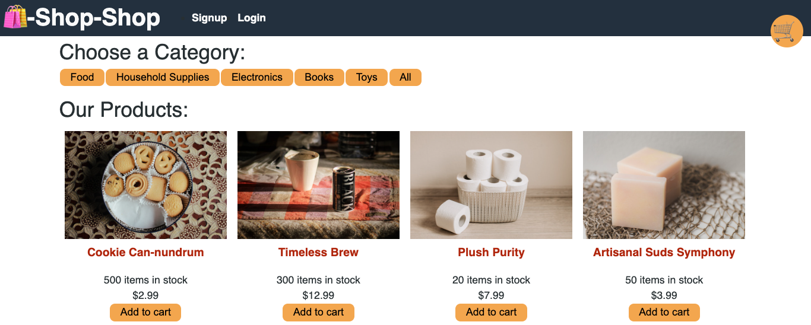

- Add products to your cart.

  **Add to Cart Button:**
  
  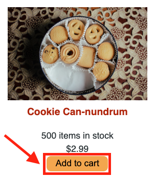

- View and edit your cart.

  **Check cart by clicking on the icon:**

  

  **Add to Cart Display:**

  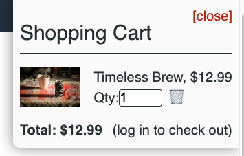

- Proceed to checkout and make a payment using the integrated Stripe functionality.

  **Sign Up to checkout:**

  

  **Sign Up Page:**

  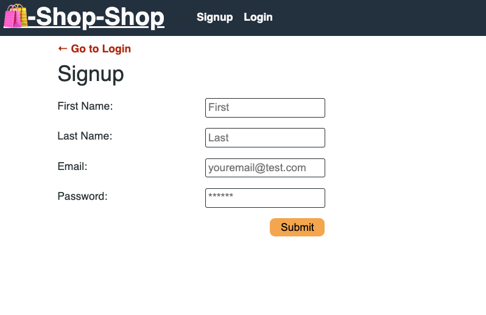

  **Login to checkout:**

  

  **Login Page:**

  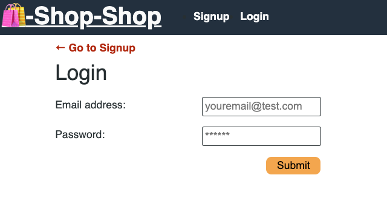

  **Checkout Page:**

  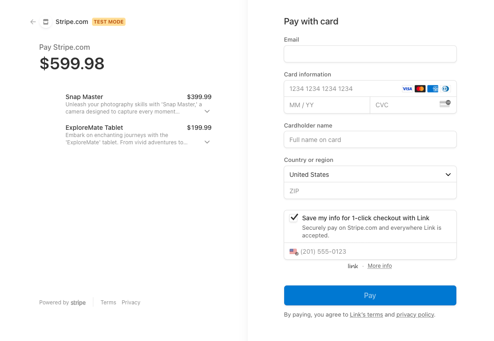

## Testing

### Server-Side Testing

The server-side of UpgradeCart is thoroughly tested using Apollo Server. To run the server-side tests, follow the steps below:

1. Navigate to the `server` directory:

   ```
   cd server
   ```

2. Run the server tests using the following command:
   ```
   npm start
   ```

This will execute the server-side tests and provide feedback on the test results.

**Click on the the link provided:**
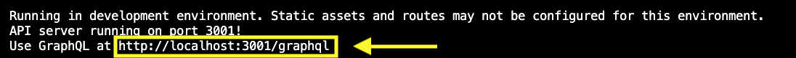

**Opening Page:**
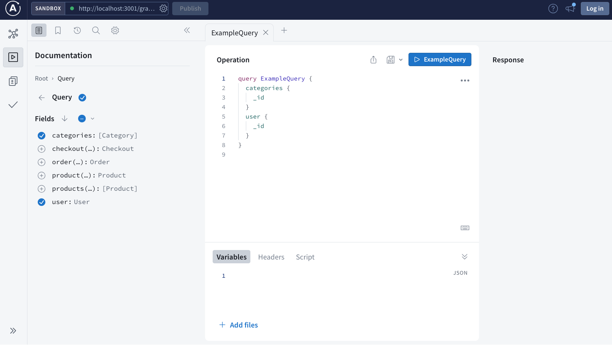

**Queries:**
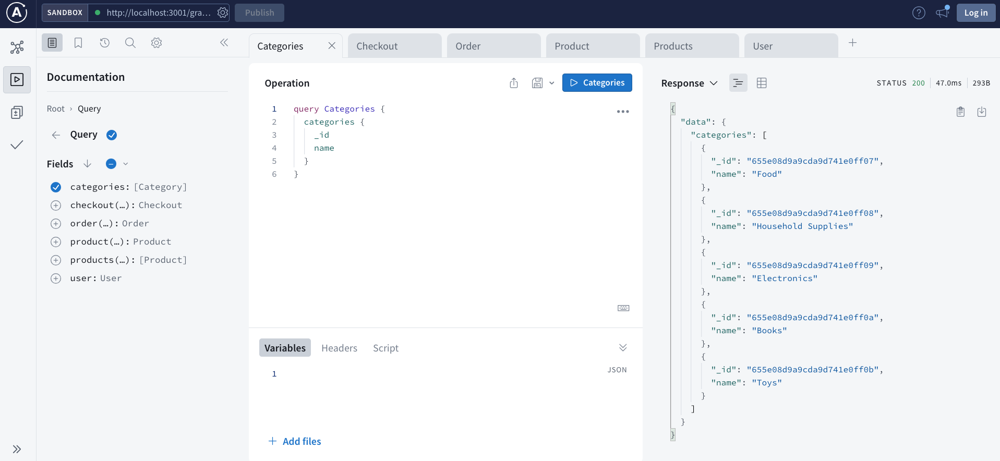

**Mutations:**
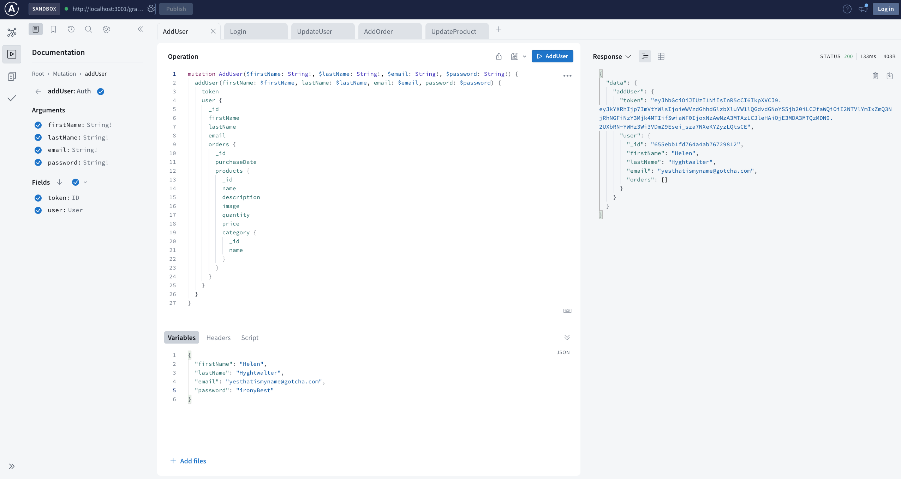

### Client-side Testing

The client-side of UpgradeCart is tested using Vitest along with Jest. The tests include comprehensive coverage for reducer functions handling various actions in the client state. To run the client-side tests, follow these steps:

1. Navigate to the `client` directory:

   ```
   cd client
   ```

2. Run the client test using the following command:
   ```
   npm test
   ```

This will execute the client-side tests and display the test results.

**Vitest in Terminal Success:**
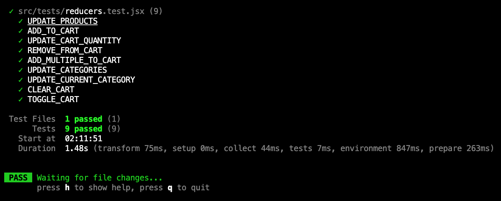

[Top](#upgradecart) | [Table of Contents](#table-of-contents)

## Links

Some sites that I found really helpful while working on this project:

- [What is Redux?](https://www.freecodecamp.org/news/what-is-redux-store-actions-reducers-explained/)
- [How does Redux Work?](https://medium.com/swlh/what-is-redux-b16b42b33820)
- [Redux Tutorials](https://redux.js.org/tutorials/index) 
- [Redux Examples](https://blog.logrocket.com/understanding-redux-tutorial-examples/)

### Live Demo
- [Heroku Deployment](https://pure-peak-08923-cf295f9d0a3a.herokuapp.com/)

Feel free to use these resources to enhance your understanding of Redux!

[Top](#upgradecart) | [Table of Contents](#table-of-contents)

## Credits

This project was developed by [Clarice Kwong](https://github.com/Clkwong3).

[Top](#upgradecart) | [Table of Contents](#table-of-contents)

## Contributing

If you'd like to contribute to the project with code or other contributions, here's how you can get started:

1. **Fork the Repository:** Start by forking the project's repository to your GitHub account.

2. **Clone the Repository:** Clone your forked repository to your local development environment.

   ```
   git clone git@github.com:Clkwong3/UpgradeCart.git
   ```

3. **Create a New Branch:** Create a new branch for your contribution.

   ```
   git checkout -b feature/your-feature-name
   ```

4. **Make Changes:** Make your desired changes or contributions.

5. **Test Your Changes:** Ensure that your changes do not introduce any new issues and pass all existing tests.

6. **Commit Your Changes:** Commit your changes with a clear and concise commit message.

   ```
   git commit -m "Add feature: your feature description"
   ```

7. **Push to Your Repository:** Push your changes to your forked repository.

   ```
   git push origin feature/your-feature-name
   ```

8. **Create a Pull Request:** Go to the project's [Pull Requests](https://github.com/Clkwong3/UpgradeCart/pulls) page, and click on "New Pull Request."

9. **Select the Base Branch:** Choose the appropriate base branch, typically the main branch of the project.

10. **Review and Submit:** Review your changes, provide a clear description of your contribution, and submit the pull request.

The project creator will review your pull request and provide feedback.

Thank you for your interest in contributing to the project!

[Top](#upgradecart) | [Table of Contents](#table-of-contents)

## Report Issue

If you encounter any issues in the project, here's how you can get involved:

**Reporting Issues**

1. **GitHub Issues:** Visit the project's [GitHub Issues](https://github.com/Clkwong3/UpgradeCart/issues) page.

2. **Search for Existing Issues:** Before creating a new issue, please search for existing ones to check if your concern has already been addressed.

3. **Create a New Issue:** If your issue isn't already listed, click on the "New Issue" button.

4. **Issue Title:** Use a descriptive and concise title that summarizes the problem.

5. **Issue Description:** In the issue description, provide the following details:

   - A clear and detailed explanation of the issue.
   - Steps to reproduce the problem if applicable.
   - Information about your environment, such as your operating system and any relevant software versions.

6. **Screenshots or Error Messages:** If you have visual aids, such as screenshots or error messages, please attach them to the issue.

7. **Labeling:** If you're familiar with labels or the issue tracking system on GitHub, you can add labels that best describe the issue. If not, don't worry; we'll handle that.

8. **Submit the Issue:** Click "Submit new issue," and the project creator will review it. We'll get back to you as soon as possible.

[Top](#upgradecart) | [Table of Contents](#table-of-contents)
